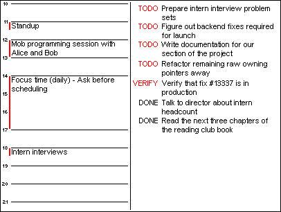

# inkymon

A small set of scripts for running a calendar & todo visualiser on the [Inky wHAT](https://shop.pimoroni.com/products/inky-what) e-ink display.

  

inkymon depends on the [Google Calendar API](https://developers.google.com/calendar) and [Google Drive API](https://developers.google.com/drive) for calendar and todo list syncing. The drivers for the Inky wHAT are provided by Pimoroni's [inky](https://github.com/pimoroni/inky) repository.